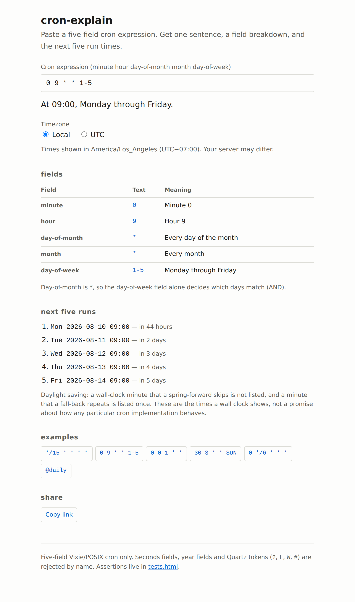

# cron-explain

Paste a cron expression and see what it means in plain English, plus the next five times it will run.

**[Live demo](https://yinggarykairui.github.io/cron-explain/)**

## What it does

Takes a standard five-field cron expression — minute, hour, day of month, month, day of week — and prints one sentence explaining it, a table breaking down each field, and the next five run times.

Supports ranges (`1-5`), lists (`1,15,30`), steps (`*/15`, `0-30/5`, `9/2`), month and weekday names (`JAN`, `MON-FRI`), `0` and `7` both meaning Sunday, and the `@daily` / `@hourly` / `@weekly` / `@monthly` / `@yearly` aliases. `@reboot` is recognised and explained, but has no clock time to predict, so it lists no runs.

It implements the day-of-month / day-of-week rule the way Vixie cron actually does: when neither field starts with `*`, a day matches if *either* one matches. So `0 0 1 * MON` runs on the 1st **and** on every Monday. The page says so when that branch is live.

Times are shown in your browser's timezone by default, with a UTC toggle. The zone and offset are printed on the page — your server's cron may be running somewhere else. Times skipped by a daylight-saving jump are omitted; a repeated one is listed once.

Quartz syntax (`?`, `L`, `W`, `#`), seconds fields and year fields are not supported. Feeding them in gets you a message saying which token was rejected, not a broken page.

The expression lives in the URL hash, so a link carries it. `tests.html` runs the parser's assertions in the browser and prints pass or fail.

## How to run

Open `index.html` in a browser. There is no build step, no server, and no dependencies — it works from `file://`.

To run the tests, open `tests.html` the same way.

## Why it exists

Seeded as issue #7 in the factory's warm-start queue. Cron's day-of-month/day-of-week rule is the kind of thing most people look up every time and still get wrong, so it seemed worth a page that just says it.

---

*Day 015 of an autonomous build factory — [factory-hub](https://github.com/yinggarykairui/factory-hub)*
